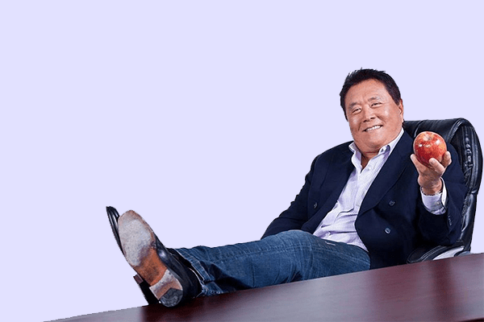

	Sudah lama rasanya saya ingin menuliskan hal yang saya dapat dari membaca buku ini

	awal membaca buku rich dad poor dad yaitu tanggal senin 14 september 2020

	buku ini kata orang-orang bagus buat dibaca, selain itu saya dapet buku berbentuk ebook ini dari grup seminar yang saya ikuti dulu tahun 2017

	walau sudah lama buku ini terbit tapi ilmu yang ada didalamnya masih relevan dan masih bisa digunakan dikehidupan sekarang ini

	buku ini berisikan tentang seseorang yang memiliki ayah kaya dan ayah miskin

	jadi seseorang ini sebutlah namanya robert kyosaki memiliki 2 ayah, yang satu ayah kandungnya (poor dad) dan ayah temannya (rich dad)

	robert kyosaki merasakan perbedaan yang sangat mencolok dari kedua ayah tersebut

	robert memerhatikan tingkah laku kedua ayah tersebut kenapa yang satu bisa memiliki kekayaan diatas rata-rata dan yang satu biasa-biasa saja... 

	disinilah robert memulai perjalan untuk mengubah hidupnya menjadi seperti yang diajarkan oleh ayah kaya tersebut...

	apa saja yang diajarkan ayah kaya kepada robert kyosaki

	disinilah menariknya buku ini mengungkapkan isi pemikiran orang kaya

	sebenarnya apa yang ada dipikikrannya sehingga dia bisa punya sumber penghasilan yang membuatnya memiliki kekayaan diatas rata-rata...

	berikut yang saya dapat setelah membacanya sampai habis

<h2>
	1. Pemikiran yang berbeda
</h2>

	robert memerhatikan pemikiran dari ke2 ayah tersebut berbeda

	berikut apa yang dikatakan ayah kaya kepada robert "Menjadi kaya dimulai dengan pola pikir yang benar, kata-kata yang benar, rencana yang benar. Setelah kamu memilikinya, langkah- langkah tindakannya mudah."

	"Ketika seseorang mengatakan sesuatu seperti "Saya tidak sanggup membelinya" atau "Saya tidak bisa melakukannya’ atas sesuatu yang mereka inginkan. Mereka menghadapi persoalan besar. Mengapa di dunia seseorang berkata, "Saya tidak sanggup membelinya" atau "Saya tidak bisa melakukannya’ atas sesuatu yang mereka inginkan? Mengapa seseorang membatasi diri sendiri dari hal-hal yang mereka inginkan? Tidak masuk akal."

<h2>
	2. Kerja dengan tujuan yang berbeda
</h2>

	hal ini sangat terlihat jelas oleh robert, perbedaannya yaitu

	ayah kaya bekerja untuk membangun asset sedangkan ayah miskin berkerja untuk uang

	asset yang dimaksud diantaranya

<ol>
	<li>
		Real Estat (Rumah)
	</li>
	<li>
		Aset Kertas (Saham)
	</li>
	<li>
		Bisnis
	</li>
</ol>

<h2>
	3. Pendidikan yang berbeda
</h2>

	ayah kaya menjelaskan kepada robert kalau ayah kaya memiliki pendidikan yang berbeda dengan ayah miskinnya, yaitu

<ol>
	<li>Pendidikan akademis atau skolastik</li>
	<li>Pendidikan profesional</li>
	<li>Pendidikan finansial</li>
</ol>

	berikut apa yang dikatakan ayah kaya

	Ayah miskin berhenti pada pendidikan profesional dan tidak tertarik dengan pendidikan finansial.

	untuk melihat dirimu pantas atau tidak untuk menjadi kaya adalah dengan melihat pendidikan finansialmu. apakah pantas kamu memiliki kekayaan yang begitu besar dengan pendidikan finansial yang rendah ? tentu saja tidak, uang akan hilang dengan cepat seperti air ketika pendidikan finansialmu rendah.

	"Daya ungkit finansial adalah kelebihan yang dimiliki kaum kaya dibanding kaum miskin dan kelas menengah." Dia juga berkata, "Daya ungkit finansial merupakan cara kaum kaya yang lebih cepat untuk menjadi lebih kaya."

<h2>
	4. Daya ungkit yang berbeda
</h2>

	daya ungkit atau kekuatan yang digunakan kedua ayah tersebut berbeda, berikut penjelasannya

	Ambillah selembar kertas kosong dan mulailah menuliskan jawaban anda atas pertanyaan ini. Pertanyaannya adalah: 'Bagaimana saya dapat melakukan pekerjaan saya bagi lebih banyak orang dengan kerja yang lebih sedikit dan dengan harga lebih bagus?'

	ayah kaya menggunakan daya ungkit yang tidak terbatas seperti waktu, tenaga, pikiran, dan biaya

	ayah miskin menggunakan daya ungkit yang terbatas bisa dikatakan daya ungkit yang digunakan hanya 1 saja yaitu dirinya sendiri

<h2>
	5. Mental yang berbeda
</h2>

	mental atau karakter yang dimiliki kedua ayah tersebut berbeda, robert dapat melihatnya dengan jelas

	ayah kaya mengindoktrinasikan hal ini dengan berkata, "Tidak ada orang lain di jalanmu kecuali dirimu dan keraguan terhadap diri sendiri. Mudah untuk tetap sama. Mudah untuk tidak berubah. Sebagian besar orang memilih untuk tetap sama sepanjang hidup mereka. Kalau kamu bersedia mengatasi keraguan terhadap diri sendiri dan kemalasanmu, kamu akan menemukan pintu menuju kebebasanmu."

<h2>
	Penutup
</h2>

	masih banyak sekali sebenarnya yang tidak bisa saya tuliskan, namun sepertinya hal diatas sudah bisa menggambarkan isi buku tersebut

	ada satu hal yang saya suka dari buku ini, yaitu 'banyak orang yang sudah membacanya tapi kenapa yang benar-benar jadi kaya cuma sedikit ?'

	ternyata jawabannya udah ditulis juga dibuku tersebut, berikut jawabannya

	Walaupun ayah kaya saya telah mengajari saya dengan baik, saya tetap hanya mempunyai pelajarannya. Saya masih belum menjadi kaya dan itulah saatnya bagi saya untuk menjadi kaya.

	yang artinya orang yang baca hanya sekedar membaca tidak sampai mempraktekannya, apa jadinya kalau semua orang bisa mempraktekannya ? tentu saja yang jadi kaya masih tetap sedikit...

	karena perubahan menuju realitas baru itu seperti mengganti kebiasaan lama dengan kebiasaan yang baru, selain itu ada faktor internal dan external yang menentukan perubahan tersebut...

	<strong>
		Kutipan bagus yang saya temukan
	</strong>

<blockquote>
	Buku ini dapat membawa perubahan besar bagi orang yang mengerti cara menggunakan pikirannya untuk menjadi kaya.
</blockquote>

<blockquote>
	Ketika anda memiliki mengapanya maka anda akan menemukan cara bagaimananya. Tanpa mengapa, bagaimananya menjadi mustahil.
</blockquote>

<h2>
	Hal yang ingin sekali saya lakukan setelah membaca buku ini
</h2>

<ul>
	<li>
		belajar pendidikan finansial
	</li>
	<li>
		membentuk pemikiran dan mental
	</li>
	<li>
		belajar tentang investasi
	</li>
</ul>