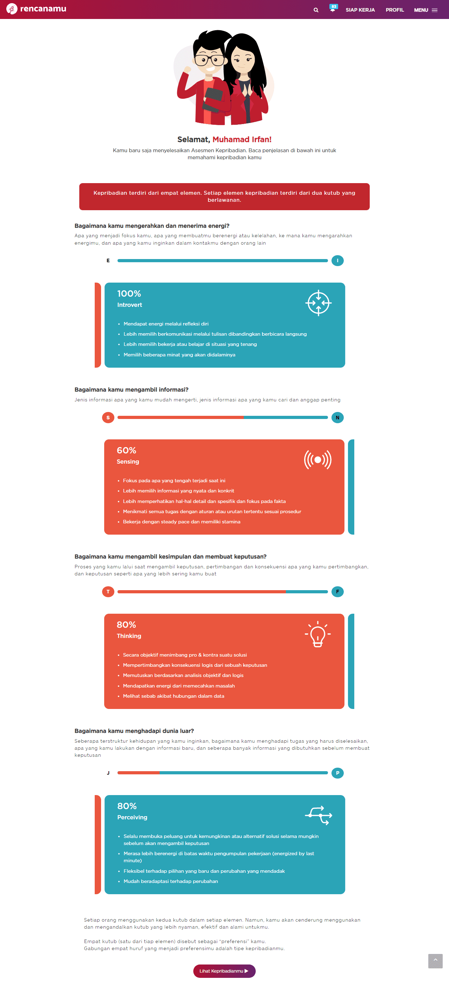
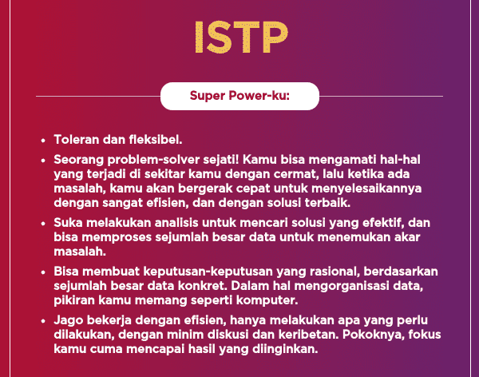

	setelah saya baca-baca lebih lanjut dari sumber hasil tes yang ada, benar saja kondisi saya saat ini memiliki kecocokan dengan kepribadian yang ada

	apa saja kecocokan yang saya rasakan ? berikut daftarnya

<strong>
	

		Saya senang membuat sesuatu
	

</strong>

	sesuatu disini maksudnya adalah hal yang dibuat tentu adalah hal yang mempermudah saya dalam mengatasi masalah-masalah yang ada

	misalnya saya membuat website kurteyki.com untuk mengatasi kegelisahan saya dalam mempelajari hal-hal baru

<strong>
	

		Saya suka bekerja menggunakan alat
	

</strong>

	tidak hanya alat yang berada didalam komputer saja yang saya pakai, terkadang alat perkakas bangunan suka saya beli misalnya bor, solder, dan lainnya

<strong>
	

		Kadang kalo ada masalah suka panik, tapi sambil nyari solusinya juga
	

</strong>

	ini udah menjadi hal yang paling bikin banyak pikiran

	misalnya ketika ada sebuah masalah katakanlah komputer rusak, tapi belum ada didepan komputernya langsung

	yang saya rasakan adalah kepanikan sambil mikir 'rusaknya kenapa yah, apa karena listriknya, apa karena power supplynya, atau apalah itu yang pasti diawalin sama panik dulu padahal belum tau permasalahannya dimana ;v'

<strong>
	

		suka nyari tahu bagaimana dan mengapa sesuatu berjalan
	

</strong>

	hal ini sering sekali saya lakukan ketika melihat sesuatu yang membuat saya penasaran sekali

	katakanlah saya penasan dengan keju dengan menyatakan pernyataan 'ko bisa ya susu jadi keju, ko bisa ya keju rasanya enak banget ada asin-asinnya gitu'

	disitu saya suka mencari jawaban dari hal-hal yang membuat penasaran seperti itu

<strong>
	

		Tidak suka membatasi diri dengan istilah introvert maupun extrovert, karena ini hanya akan membatasi fleksibilitas
	

</strong>

	ini menurut pandangan saya saja sih, kalau saya mengakui saya adalah introvert maupun extrovert takutnya nanti malah membebani pikiran

	misalnya dengan pernyataan 'ah gua mah intropert gua sukanya menyendiri, gua mah extropert sukanya diluar terus'

	kalau saya melakukan seperti hal diatas itu sama aja kaya membatasi diri

	makannya saya lebih memilih tidak mempermasalahkan kedua hal ini, tapi jujur aja saya emang merasa ber-energi banget kalo lagi sendiri

<strong>
	

		sulit mengungkapkan perasan (ekspresif), tapi sebenernya ingin sekali
	

</strong>

	ini yang sangat bertentangan sama diri saya, terkadang saya ingin sekali memberikan ekspresi keseseorang tapi entah kenapa rasanya sulit

	misalnya ketika ada anak perempuan yang menangis dibangku taman

	disini sebenarnya gua pengen ngungkapin pernyataan 'kamu kenapa nangis ?, ngasih tisu buat ngelap air matanya'. sayangnya pernyataan itu cuma ada didalem hati doang gasampe jadi kenyataan...

<strong>
	

		Kehidupan bersosial gak kacau-kacau amat, tapi jujur saat ini gua kaya gapunya temen
	

</strong>

	ini yang membuat gua yakin kalau gua itu ISTP karena ada bukti yang valid

	gua dianggep misterius, dingin, gapengen dideketin, serius, dll.

	bahkan dulu pernah denger ada yang nyatain 'serius banget dia...'

	dalem hati gua 'qwqwqwqwqw, qwqwqwqw, qwqwqwqw, bingung gua kenapa bisa kaya gini sih, dianggep misterus-serius, nyatanya ga kaya gitu...'

	udah 3 tahun belakangan ini gua emang jarang banget interaksi sama orang-orang lama, apalagi yang baru. gua merasa kaya ga ada temennya

	gua sadar emang udah lama gabanyak interaksi. makannya pasti gabakalan banyak reaksi juga...

<strong>
	

		Jiwa petualang gua tinggi, tapi ditekan terus sama sifat introvert yang ada
	

</strong>

	ada niatan buat ngerantau, tapi nyatanya sampe sekarang masih dirumah aja

	tapi ini beneran harus gua lakuin biar bisa ngerasain hidup yang benar-benar hidup itu kaya gimana sih, rasanya tinggal sendiri, mau ngunjungin tempat apa nih...

<strong>
	

		kalau gua disuruh milih mau ngelakuin olahraga atau rekreasi apa, gua bakal pilih sky ice, paralayang, terjun payung
	

</strong>

	ini adalah hal yang gua pengen cobain secepatnya, karena penasaran banget sama rasanya itu gimana sih

	rasanya main sky ice, rasanya nyobain nyangkut dilayangan, rasanya lompat dari ketinggian terus buka parasut

<strong>
	

		kadang kalau lagi chattingan suka ngejokes dikit walau galucu-lucu amat
	

</strong>

	yah ini emang udah jadi hal biasa buat gua biar pas chattingan ada rasanya dikit

	kadang suka ngebelokin fakta, ngebikin rasa penasaran, dll

	tapi jokes ini juga disesuain sama kondisi, biasanya hanya sama yang bener-bener kenal aja

<strong>
	

		Berorientasi pada hasil bukan berarti mengabaikan prosesnya
	

</strong>

	kalau ga ada hasilnya biasanya perasaan setelah ngelakuinnya itu kaya ga ada manis-manisnya gitu

	makannya lebih suka sama ngerjain yang ada hasilnya, salah satunya ya tulisan ini

	prosesnya emang b aja daripada hasilnya, tapi tentu prosesnya mikir panjang

	Referensi Kepribadian

<ul>
	<li>
		<a target="_blank" rel="nofollow noopener noreferrer" href="https://www.golife.id/psikotes/tes-kepribadian-mbti/istp/">
			Kepribadian ISTP
		</a>
	</li>	
</ul>