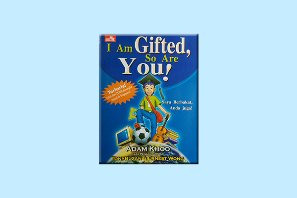
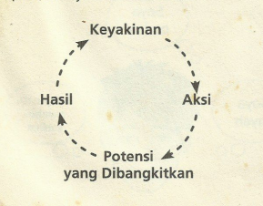

	Baca Buku I'am Gifted So Are You

	Sudah lama rasanya saya membaca buku ini

	dan sebenarnya sudah jauh-jauh hari juga mau mengulasnya

	buku ini menurut saya sangat bagus sekali karena berisikan tentang perjalan perubahan seseorang yang awalnya tidak berbakat menjadi berbakat

	dia menjelaskan bagaimana caranya untuk merubah keadaan yang tidak mungkin menjadi mungkin...

	yang membuat buku ini menarik bagi saya yaitu selain menjelaskan bagaimana cara belajar yang efektif buku ini juga mengajarkan tentang pengembangan diri

	berikut yang dapat saya pelajari dari buku ini

<h2>
	1. Pengalaman menemukan diri adalah hal yang paling penting
</h2>

	kata-kata ini tidak asing bagi saya karena terdapat juga dibuku rich dad poor dad yang saya baca

<h2>
	2. Beda Orang, Beda Strategi, Beda Hasil
</h2>

	maksud dari kata-kata ini adalah setiap orang memiliki caranya masing-masing saat melakukan sesuatu

	katakanlah disuatu keluarga memiliki 3 orang anak sebut saja a, b dan c	

	ke 3 anak ini sepakat untuk berlomba menentukan siapa yang paling kaya dari keluarga ini dalam waktu 5 tahun

	dari ke 3 anak ini setiap anak memiliki strateginya masing-masing

	si a memilih untuk membuka bisnis sesuai dengan skillnya

	si b memulai mencari pejerkaan dengan skillnya

	sedangkan si c memulainya dengan strategi rahasia

	menurut kalian mana yang akan jadi paling kaya ? a, b atau c 

	sayapun tidak tau pasti jawabannya tapi kalau dari sudut pandang saya ke3nya berpotensi namun yang siapa yang paling kaya saya menentukan kalau si c lah yang bakal jadi kaya

	bisa saja si c memilih untuk menikah dengan orang kaya, yang membuatnya kaya dalam waktu singkat atau bisa saja si c sudah punya sumber penghasilan yang si a dan b tidak tau

<h2>
	3. Kerangka Berfikir Pemenang dan Pecundang
</h2>

	yang saya dapat dari membaca bab ini sangat mirip sekali dengan buku yang saya baca sebelumnya

	semua bermula dari cara berfikir, kalau mau merubah sesuatu dalam hidup berarti harus merubah pikirannya dulu

<h2>
	4. Mulailah membentuk Keyakinan yang bermanfaat
</h2>

	keyakinan disini maksdunya adalah keyakinan yang kamu yakini tentang diri sendiri

	dibuku ini diajarkan untuk selalu meyakini hal-hal yang bersifat positif tentang diri sendiri misalnya 'saya pandai bersosialisasi, nyari kerja itu mudah, dapet duit itu gampang'

	ketika keyakinan positif ini kamu tanamkan dalam diri maka setiap tindakan yang dilakukan akan membangkitkan tindakan yang positif juga

	flownya seperti ini

<h2>
	5. 'Saya tidak tahu' - dapat membunuh perkembangan otak
</h2>

	lagi-lagi saya menemukan kecocokan kata yang sama saat membaca buku sebelumnya

	maksudnya adalah ketika saya mengucapkan 'saya tidak tahu' maka seketika otak saya akan berhenti untuk memikirkannya...

	cobalah untuk tidak menggunakan kata-kata tersebut

<h2>
	6. Teknik Belajar yang Efektif
</h2>

	hal ini merupakan bagian favorit dari buku ini, untuk mempercepat dalam memahami sesuatu maka setiap orang pastinya harus mengerti bagaimana cara dia menyerap informasi

	ketika seseorang sudah tau bagaimana cara belajarnya maka mau belajar apapun materinya pasti akan mudah untuk dipahami

	berikut teknik belajar yang saya dapat dari buku ini

<ul>
	<li>Power Reading</li>
	<li>Mind Mapping</li>
	<li>Super Memory</li>
	<li>Pola Memory</li>	
</ul>

<h2>
	7. Kekuatan Cita-Cita
</h2>

	rahasia semua orang yang berhasil adalah karena dia memimpikan hal tersebut agar terjadi dalam kehidupannya

	perhatikan saja setiap artis tokoh sukses pasti memilikinya

<h2>
	8. Bagaimana cara Meninggalkan Penundaan
</h2>

	penundaan adalah hal yang sering dilakukan pada beberapa orang, namun pernahkah kalian berfikir bagaimana cara mengatasinya ?

	didalam buku ini saya diajarkan caranya dan itu sebenarnya mudah sekali untuk dilakukan

	saya hanya perlu menghubungkan kesusahan dengan kesenangan melalui apa yang saya pikirkan

	kaya semacam menciptakan emosi ketakutan gitu, seperti 'kalau saya nggak ngelakuin ini sekarang maka nanti saya nggak dapet ini dan kehidupan saya kedepannya pasti bakal jadi seperti ini...'

<h2>
	9. Orang yang menguasai waktu, menguasai hidup
</h2>

	orang yang bisa mengatur waktu maka dia bisa mengatur kehidupannya 

	didalam bab ini menjelaskan bagaimana caranya mengatur kegiatan sehari-hari dengan cara mengelompokannya dengan prioritas

	prioritas tersebut ada 4 yaitu

<ul>
	<li>p1 (sesuai tujuan mendesak)</li>
	<li>p2 (sesuai tujuan dan tidak mendesak)</li>
	<li>p3 (tanpa tujuan dan mendesak)</li>
	<li>p4 (tanpa tujuan dan tidak mendesak)</li>	
</ul>

	untuk bisa mengatur waktu maka diharuskan untuk membagi setiap kegiatan penting dan tidak penting seperti ini

<ul>
	<li>
		p1 (20%)
	</li>
	<li>
		p2 (60%)
	</li>
	<li>
		p3 (15%)
	</li>
	<li>
		p4 (5%)
	</li>				
</ul>

<h2>
	10. Menghimpun Kekuatan Dalam waktu singkat
</h2>

	bab ini menjelaskan bagaimana caranya menciptakan emosi dengan cepat untuk mendapatkan semangat lebih

	emosi itu pada dasarnya terbentuk dari apa yang kita rasakan, contohnya pas lagi nonton drakor pasti bakalan ada emosi yang tercipta

	nah emosi juga sebenarnya bisa dibuat secara mandiri yaitu dengan melakukan tindakan dan menanamkan pikiran tertentu agar bisa memunculkannya

<h2>
	Penutup
</h2>

	seperti itulah review dari buku ini, tidak banyak yang saya jelaskan secara terperinci namun hal diatas sudah bisa menggambarkan isi bukunya

	kutipan favorit yang paling saya suka dari buku ini adalah

<blockquote>
	Penundaan adalah rintangan utama dari semua kesuksesan
</blockquote>