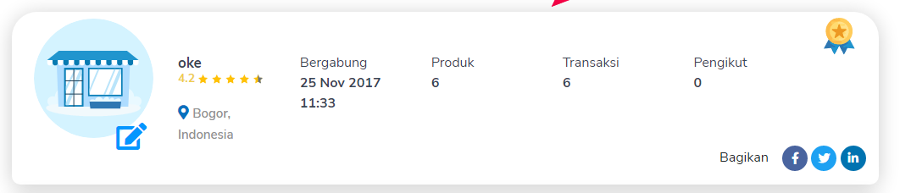

	saya mau bernostalgia ketahun 2017, yang dimana tahun tersebut merupakan pertama kalinya saya mencoba jualan online

	saat itu saya suka melihat-lihat produk non-fisik atau bisa disebut juga produk digital

	sampai seketika saya mempunya ide untuk berjualan produk digital juga

	ide yang terlintas dipikiran saya saat itu adalah berjualan template blogger

	saya buatlah template blogger yang fungsinya bukan untuk konten melainkan untuk menyembunyikan link asli (safelink) 

	seperti biasa sebelum membuat sesuatu saya selalu melakukan riset kompetitor, fitur, dan mencari inspirasi

	singkat cerita setelah berhasil membuat template safelink tersebut, saya langsung membuat akun dimarket place digital dan memposting produk digital saya tersebut

	saat itu saya tidak berharap banyak, saya pasang harga dikisaran 5 dolar atau stara 60 ribuan

	hari-hari berlalu saya bersemangat untuk mengecek market place

	tapi tetap tidak ada yang beli, wkwkwkwk...

	namun setelah lumayan lama ternyata ada orderan masuk dan langsunglah saya proses

	file template saya kirim lalu melakukan konfirmasi dan terjualah produk digitla pertama saya

	tidak lama setelah terjual, produk digital tersebut mulai ada yang beli lagi kalau tidak salah kisaran sampai 5-6 pembeli

	saat sampai kepenjualan terakhir saya memilih berhenti untuk menjualnya dan menghapus produknya

	ini karena ada yang membeli dan memberi rate bintang 1 dan saya mendapat review pedas, sampai-sampai saya kena mental

	saya langsung chat pembeli tersebut, apa masalahnya dan dia hanya membalas begini dan begitu tanpa ada niatan untuk dibantu

	sayapun mencoba untuk mengembalikan uangnya tapi tetap dia menolaknya, seakan-akan memang sengaja dia membeli produk tersebut untuk menjatuhkan ratingnya...

	tahun-tahun berlalu, saya masih suka melihat marketplace tersebut sampai sekarang

	melihat akun saya masih ada, saya jadi memiliki sudut pandang yang berbeda

	saya melihat sudut pandang review tersebut dengan cara yang berbeda

	saya paham maksudnya tujuan orang tersebut memberi review pedas seperti itu maksudnya apa

	kalau sekarang saya lihat produk tersebut, saya akan menutup mata dengan tangan untuk melihatnya karena seperti produk gagal wkwkwkw

<h2>
	Penutup
</h2>

	mental itu penting

	gak selamanya usaha akan selalu mudah ada aja hal yang bakal membuatnya susah

<blockquote>
	saat terakhir kali saya mau melihat history reviewnya ternyata sudah tidak ditampilkan lagi, jadi hanya tampil profil dengan total rating saja
</blockquote>