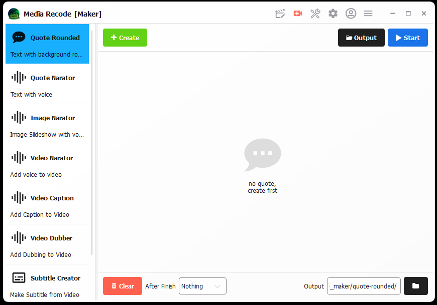

this is the application that i as a product at ykywz

The main function of this application is to edit videos in bulk

Apart from that, there are many other functions available, such as creating simple videos 

such as written videos, narrative videos, or caption videos

This application also uses AI to manage several processes such as removing music, generating titles and descriptions, and others

In the future, I will use this application to create content because it has so many features

and the feature that I like is the narrator scene, I can make videos from several scenes as well as voice over
